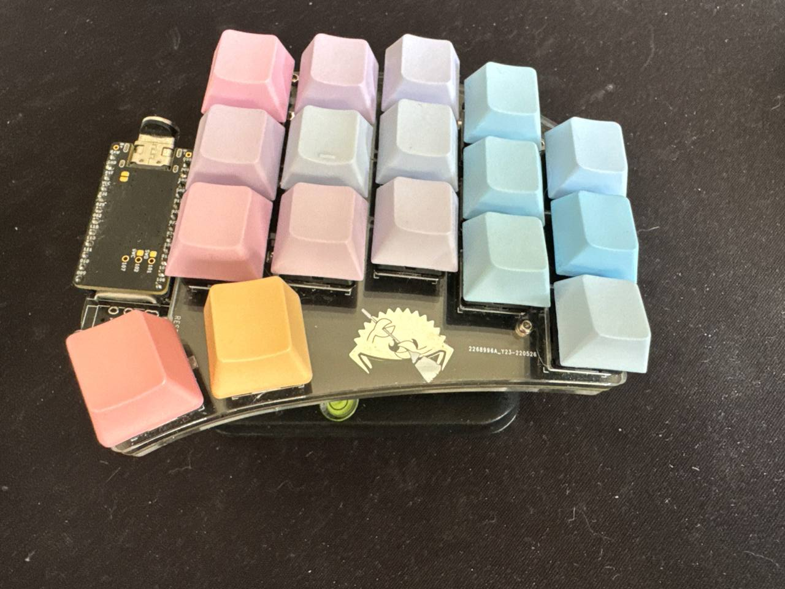

# Ferris Sweep



* [Ferris Sweep - Beekeeb](https://shop.beekeeb.com/products/ferris-sweep-keyboard-diy-kit)
* [keymap](config/cradio.keymap)

## Flashing
I did not solder any flash button. Either use tweezers or the
software-configured key.

## With tweezers
Short-circuit 2nd and 3rd top-left pin on left half.

## Software-coonfigured key
- Activate `CUR` layer

```
//  ---------------------------------------`   '----------------------------------------
// |       |       |       |       |       |   |        |       |       |       |       |
//  ---------------------------------------`   '----------------------------------------
// |       |       |       |       |       |   |        |       |       |       |       |
//  ---------------------------------------`   '----------------------------------------
// |       |       |       |       |       |   |        |       |       |       |       |
//  ---------------------------------------`   '----------------------------------------
//                    ---------------------     -----------------------
//                   |           | RET/CUR |   |           |           |
//                    ---------------------     -----------------------
```

- Press `Blue`

```
//  ---------------------------------------`   '----------------------------------------
// |       |       |       |       |       |   |        |       |       |       |       |
//  ---------------------------------------`   '----------------------------------------
// |       |       |       |       |       |   |        |       |       |       |       |
//  ---------------------------------------`   '----------------------------------------
// | Blue  |       |       |       |       |   |        |       |       |       |       |
//  ---------------------------------------`   '----------------------------------------
//                    ---------------------     -----------------------
//                   |           |         |   |          |           |
//                    ---------------------     -----------------------
```

- Press `Boot`

```
//  ---------------------------------------`   '----------------------------------------
// |       |       |       |       |       |   |        |       |       |       |       |
//  ---------------------------------------`   '----------------------------------------
// |       |       |       |       |       |   |        |       |       |       |       |
//  ---------------------------------------`   '----------------------------------------
// |       |       |       |       | Boot  |   |        |       |       |       |       |
//  ---------------------------------------`   '----------------------------------------
//                    ---------------------     -----------------------
//                   |           |         |   |           |           |
//                    ---------------------     -----------------------
```

## Updating
Open a file system GUI tool and copy the firmware file
`cradio_left-nice_nano__zmk-zmk.uf2` from
https://github.com/arialdomartini/zmk-config/actions/ artifact.
